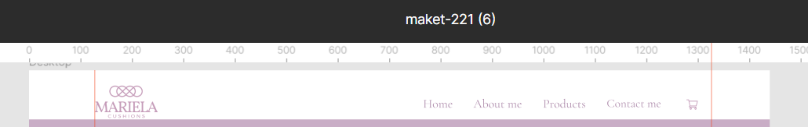
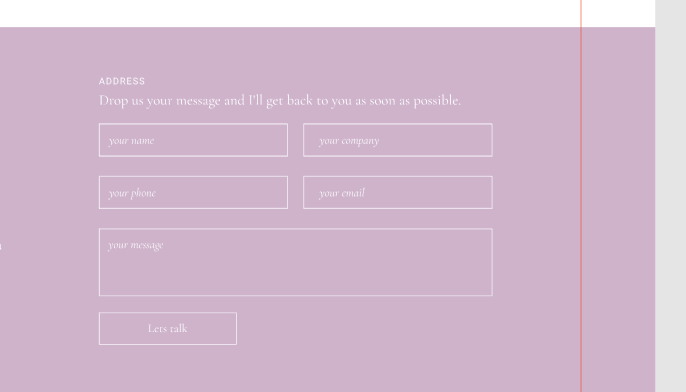
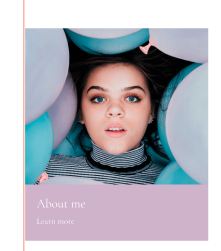
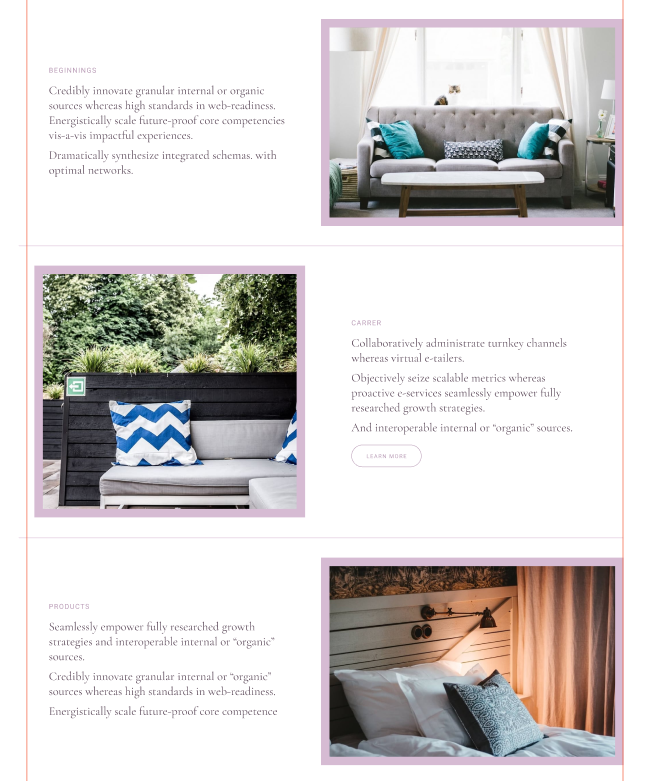

# git-branching_bem
## Задание 1
* `голова`
  * `голова__волосы волосы волосы--длина-короткие волосы--цвет-чёрный`
  * `голова__уши уши`
    * `уши__ухо ухо ухо--левое`
    * `уши__ухо ухо ухо--правое`
  * `голова__лицо лицо`
    * `лицо__глаз глаз глаз--левый глаз--цвет-голубой`
    * `лицо__глаз глаз глаз--правый глаз--цвет-голубой`
    * `лицо__нос нос нос--размер-средний`
    * `лицо__рот рот`
* `тело тело--размер-худое`
  * `тело__руки руки`
    * `руки__рука рука рука--левая рука--часы`
      * `рука__пальцы пальцы`
        * `пальцы__палец палец палец--большой`
        * `пальцы__палец палец палец--указательный`
        * `пальцы__палец палец палец--средний`
        * `пальцы__палец палец палец--безымянный`
        * `пальцы__палец палец палец--мизинец`
    * `руки__рука рука рука--правая`
      * `рука__пальцы пальцы`
        * `пальцы__палец палец палец--большой`
        * `пальцы__палец палец палец--указательный`
        * `пальцы__палец палец палец--средний`
        * `пальцы__палец палец палец--безымянный`
        * `пальцы__палец палец палец--мизинец`
* `ноги`
  * `ноги__нога нога нога--левая`
  * `ноги__нога нога нога--правая`
## Задание 2

### header 
  

  `header.header>.wrapper.header__container>(a.header__logo.link.link--hover-off>img.header__logo-img)+nav.header__menu>ul.header__menu-list>(li.header__menu-item*4>a.link)+li.header__menu-item>a.link.link--hover_off>img.icon-cart`

### форма
  

  `form.contact-form.contact-form--theme-pink>(.contact-form__desc>p.contact-form__title.title.title--size-m+p.contact-form__text.text.text-size-m)+(fieldset.input-group>legend.input-group__header.hidden+(label.input-group__label.input-group__label--width-half*4>span.hidden+input.input.input-group__input)+label.input-group__label.input-group__label--width-full>span.hidden+textarea.input-group__textarea.textarea.textarea--resize-off)+button:s.btn.contact-form__btn`

### карточка
  

  `.card.card--theme-pink>(.card__header>img.card__image)+.card__body>.card__title.title+a.link>p.card__text.text`

### Cписок

  `ul.list.list--vertical.list--theme-white>(li.list__item.row>(.list__item-desc.col.col--width-half>.col__title+p.col__text*3)+img.list__item-img)+(li.list__item.row>img.list__item-img+.list__item-desc.col.col--width-half>.col__title+p.col__text.col__text--color-grey*3+a.link.link--theme-button)+li.list__item>(.list__item-desc.col.col--width-half>.col__title+p.col__text*3)+img.list__item-img`